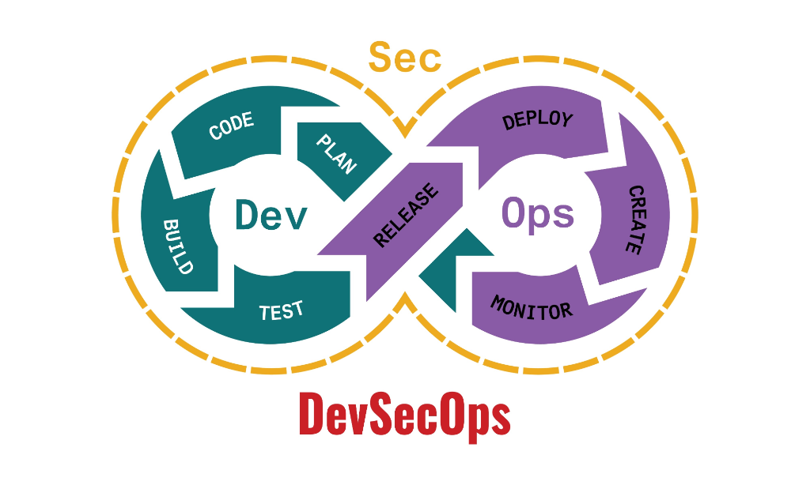

# OpsGuardian 
> **The Autonomous SRE with Human-in-the-Loop Safety.**


OpsGuardian is a production-ready **Autonomous Site Reliability Engineer (SRE)** designed to diagnose issues, propose fixes, and execute runbooks—all while keeping a human in the loop for critical decisions. Built on **Google Gemini 2.5 Flash Lite**, it combines the speed of AI with the safety of enterprise-grade security protocols.

📺 [**Watch the Video**](https://youtu.be/Pb5cLCRJ9Y8)

---

## Architecture


> The system consists of a Next.js Dashboard, a FastAPI Agent Backend (running Gemini 2.5 Flash Lite), and a secure Dockerized Sandbox for script execution.

---

## Why OpsGuardian?

Traditional DevOps is manual and reactive. OpsGuardian is autonomous and proactive.

| Feature | Traditional DevOps | OpsGuardian 🛡️ |
| :--- | :--- | :--- |
| **Diagnosis** | Manual log parsing (Minutes/Hours) | **Instant AI Analysis** (Seconds) |
| **Response** | Human wakes up, logs in, types commands | **Autonomous Watchdog** detects & proposes fixes |
| **Knowledge** | Scattered wikis & outdated docs | **RAG Integration** reads PDF Runbooks instantly |
| **Safety** | "Cowboy coding" in production | **Secure Sandbox** with "Edit-Before-Run" workflow |
| **Alerts** | Email floods | **Smart Discord Notifications** |

---

## Security Architecture

OpsGuardian was built with a "Security First" mindset. We don't just run AI code; we sandbox it.

### 1. The "Edit-Before-Run" Jail
AI agents can hallucinate dangerous commands. OpsGuardian **NEVER** executes generated Python scripts automatically.
- **Workflow:** Agent proposes script -> Request created -> Human reviews/edits in Modal -> Human Approves -> Script runs in ephemeral sandbox.
- **Result:** Zero risk of accidental data loss or rogue processes.

### 2. Path Traversal Protection
The file system is strictly jailed to the `agent_workspace`.
- Attempts to access `../../etc/passwd` or `../main.py` are blocked at the API level.
- Automated fuzzing tests confirm that the agent cannot escape its designated workspace.

### 3. Command Injection Remediation
All internal system monitors use secure argument parsing (`shlex`) to prevent shell injection attacks.

---

## Installation

### Prerequisites
- Docker & Docker Compose
- Google Gemini API Key

### Quick Start

1. **Clone the Repository**
   ```bash
   git clone https://github.com/Mohammed-Zain-ul-Hassan/OpsAgent-google.git
   cd OpsAgent-google
   ```

2. **Configure Environment**
   Create a `.env` file in the root directory:
   ```env
   GOOGLE_API_KEY=your_gemini_api_key_here
   DISCORD_WEBHOOK_URL=your_discord_webhook_url (Optional)
   FRONTEND_URL=http://localhost:3000
   ADMIN_PASSWORD=your_secure_password (Optional, defaults to 'admin')
   ```

3. **Launch with Docker**
   ```bash
   docker-compose up --build
   ```

4. **Access Dashboard**
   - Frontend: [http://localhost:3000](http://localhost:3000)
   - Backend Docs: [http://localhost:8000/docs](http://localhost:8000/docs)
   - **Default Password:** `admin`

---

## Security Audit Report

We take security seriously. Below is the summary of our latest self-audit.

<details>
<summary><strong>Click to view Security Audit Summary (PASSED)</strong></summary>

### Executive Summary
The OpsGuardian system has undergone a comprehensive security audit and testing phase. The system successfully implements the "Edit-Before-Run" workflow, preventing unauthorized script execution. Authentication and file system protections are active and effective against common attacks.

### Key Findings
- **Vulnerability Scanning:** PASSED. Path traversal and Auth bypass attempts were blocked.
- **RCE Remediation:** PASSED. Critical `shell=True` vulnerability in monitoring module was remediated and verified.
- **Manual Verification:** PASSED. Authentication, File Operations, and Script Approval workflows function as designed.

*Audit Date: 2025-12-01*
</details>

---

## 📄 License

This project is licensed under the MIT License - see the [LICENSE](LICENSE) file for details.
